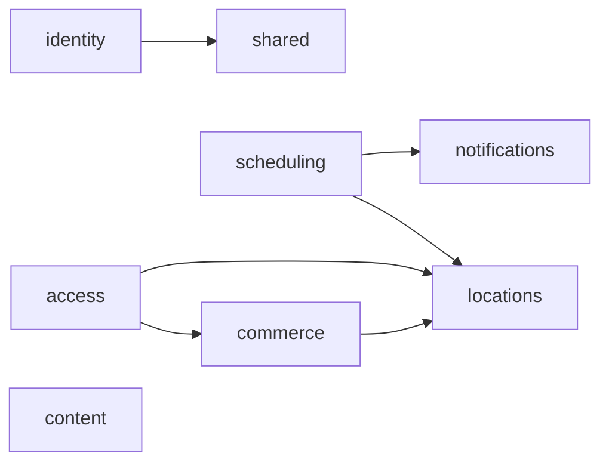

# Arquitectura de FitPass Gym

FitPass Gym es un monolito modular: se construye y despliega como una sola
aplicacion Django, pero el codigo se organiza por capacidades de negocio. Los
modulos comparten la base de datos y las transacciones de Django sin exponer su
implementacion interna a traves de una red.

## Modulos

| Modulo | Responsabilidad | API publica interna |
|---|---|---|
| `identity` | Tokens y autenticacion HTTP | `ApiToken`, login |
| `locations` | Sedes, salas e instructores | modelos, busqueda por distancia |
| `scheduling` | Clases, reservas, espera y asistencia | casos de uso de reservas |
| `commerce` | Productos, promociones, compras y pagos | compra de productos |
| `access` | Vigencia de membresias y check-in | validacion y registro de acceso |
| `content` | Catalogo virtual de entrenamientos | consulta de workouts |
| `notifications` | Notificaciones internas | modelo `Notification` |
| `shared` | Utilidades HTTP sin reglas de negocio | autenticacion y errores JSON |

Cada modulo contiene sus propios `models.py`, `services.py`, `api.py` y
`urls.py` cuando los necesita. `gym/urls.py` compone los endpoints en la API
unica. Los archivos `gym/models.py`, `gym/services.py` y `gym/views.py` son
fachadas de compatibilidad; el codigo nuevo debe importar desde el modulo que
posee la funcionalidad.

## Dependencias



Reglas de dependencia:

1. Un modulo puede usar otro solamente mediante modelos o servicios publicos.
2. Las vistas HTTP delegan reglas de negocio a `services.py`.
3. `shared` no depende de reglas de negocio; la referencia a tokens solo sirve
   como adaptador de autenticacion.
4. Las integraciones externas se resuelven mediante las rutas configuradas en
   Django settings, no desde las vistas.
5. Las operaciones que cambian varios agregados se ejecutan en una transaccion
   dentro del servicio que coordina el caso de uso.

## Persistencia y compatibilidad

Todos los modelos conservan el `app_label` `gym`. Por eso siguen usando las
tablas `gym_*` creadas por las migraciones existentes. La reorganizacion no
requiere renombrar tablas ni mover datos. Antes de integrar cambios se debe
verificar:

```powershell
python manage.py check
python manage.py makemigrations --check --dry-run
python manage.py test fitpassgym.gym
```

## Agregar una capacidad

1. Crear un paquete bajo `fitpassgym/gym/<capacidad>/`.
2. Mantener modelos, servicios, API y rutas dentro de ese paquete.
3. Importar sus modelos en `gym/models.py` para que Django los registre.
4. Componer sus rutas desde `gym/urls.py`.
5. Declarar y probar cualquier dependencia con otro modulo.
