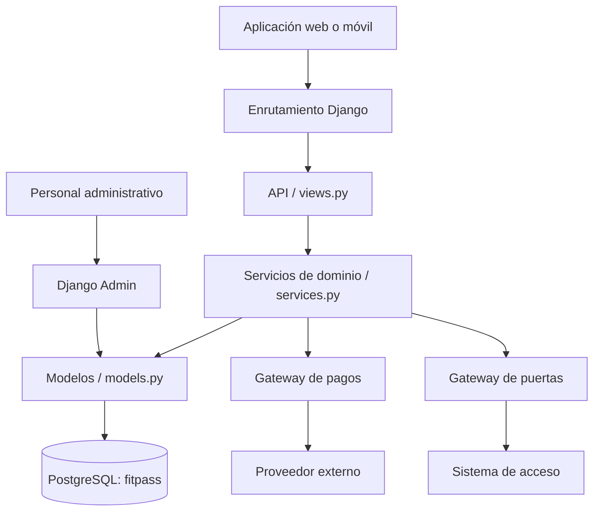
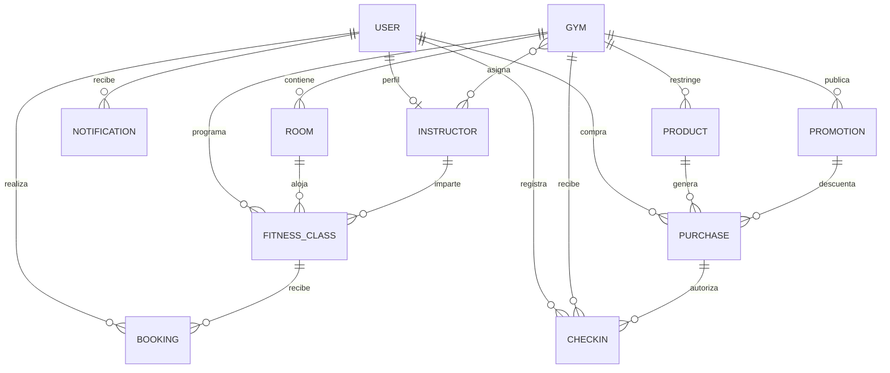
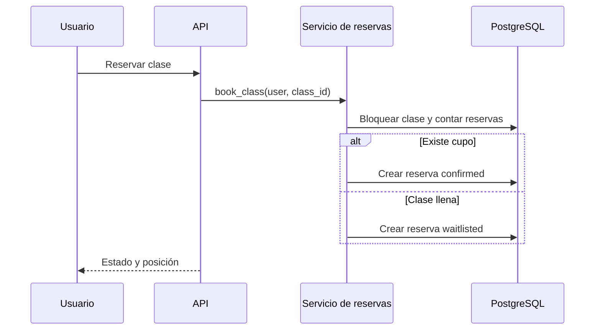
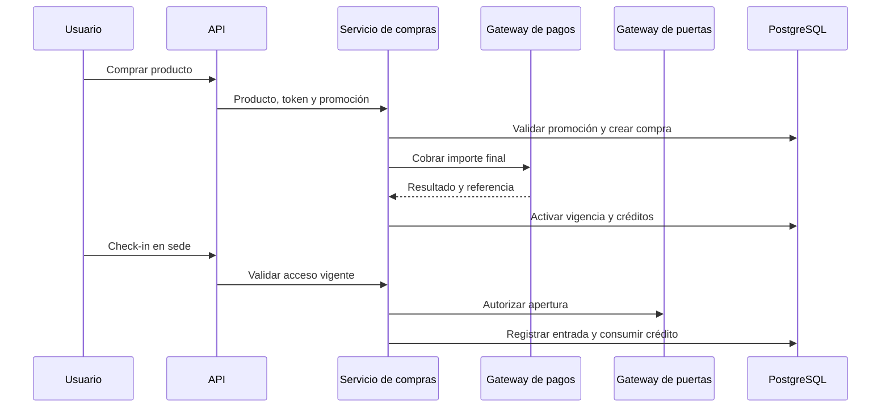

# FitPass Gym API

Monolito modular desarrollado con Django y PostgreSQL para administrar sedes,
clases, reservas, listas de espera, asistencia, accesos, productos, promociones,
pagos y contenido virtual de una red de gimnasios.

## Estado de la implementación

La API está implementada bajo `/api/`. Incluye:

- búsqueda de gimnasios cercanos mediante distancia Haversine;
- consulta de clases presenciales y virtuales;
- reserva, cancelación y lista de espera automática;
- promoción del primer usuario en espera cuando se libera un cupo;
- registro de asistencia por el instructor asignado;
- membresías nacionales y locales, pases diarios y paquetes de entrenamiento;
- promociones nacionales o específicas de una sede;
- compra mediante un gateway de pagos intercambiable;
- validación de acceso y check-in mediante un gateway de puertas;
- catálogo de entrenamientos grabados;
- notificaciones internas para eventos de clases y lista de espera;
- administración de todas las entidades mediante Django Admin.

## Arquitectura monolítica

La solución utiliza un monolito modular: la API, las reglas de negocio, la
persistencia y los adaptadores externos se despliegan como una sola aplicación,
pero están separados por responsabilidades dentro del código.



### Capas

| Capa | Archivo | Responsabilidad |
|---|---|---|
| Configuración | `fitpassgym/settings.py` | Aplicaciones, PostgreSQL, zona horaria y adaptadores externos |
| Enrutamiento principal | `fitpassgym/urls.py` | Rutas `/`, `/admin/` y `/api/` |
| API HTTP | `fitpassgym/gym/views.py` | Validación de entradas, autenticación y respuestas JSON |
| Enrutamiento del dominio | `fitpassgym/gym/urls.py` | Endpoints de gimnasios, clases, reservas, compras y workouts |
| Servicios de dominio | `fitpassgym/gym/services.py` | Reservas, cupos, promociones, pagos, acceso y asistencia |
| Persistencia | `fitpassgym/gym/models.py` | Entidades y relaciones almacenadas por Django ORM |
| Integraciones | `fitpassgym/gym/integrations.py` | Adaptadores intercambiables de pagos y control de puertas |
| Administración | `fitpassgym/gym/admin.py` | Gestión de entidades desde Django Admin |
| Migraciones | `fitpassgym/gym/migrations/` | Versionado y creación del esquema PostgreSQL |
| Pruebas | `fitpassgym/gym/tests.py` | Pruebas de lista de espera, compras, descuentos y check-in |

### Estructura del proyecto

```text
fitpassgym/
├── manage.py
├── requirements.txt
├── .env.example
├── guia.md
├── fitpassgym/
│   ├── settings.py
│   ├── urls.py
│   ├── asgi.py
│   ├── wsgi.py
│   └── gym/
│       ├── admin.py
│       ├── apps.py
│       ├── integrations.py
│       ├── models.py
│       ├── services.py
│       ├── urls.py
│       ├── views.py
│       ├── tests.py
│       └── migrations/
│           └── 0001_initial.py
└── README.md
```

## Modelo de datos



### Entidades

| Entidad | Propósito |
|---|---|
| `Gym` | Sede, ubicación geográfica, país, zona horaria y equipamiento |
| `Room` | Sala perteneciente a una sede, con capacidad y equipamiento |
| `Instructor` | Perfil asociado a un usuario, sedes y especialidades |
| `FitnessClass` | Clase, horario, instructor, cupo, modalidad y enlaces virtuales |
| `Booking` | Reserva del usuario y estado confirmado, espera, cancelado, asistió o ausente |
| `Product` | Membresía, pase diario o paquete; alcance nacional, local o virtual |
| `Promotion` | Descuento porcentual nacional o local con período de vigencia |
| `Purchase` | Resultado del pago, vigencia del acceso y créditos restantes |
| `CheckIn` | Entrada autorizada a una sede y referencia del sistema de puertas |
| `Workout` | Entrenamiento grabado publicado en el catálogo virtual |
| `Notification` | Aviso interno de cambios, cancelaciones, recordatorios o promoción de espera |

Además de estas tablas, Django crea sus tablas estándar para usuarios, grupos,
permisos, sesiones y administración.

## Flujos de negocio

### Reserva y lista de espera



La operación usa una transacción y bloqueo de la clase para reducir sobreventas.
Cuando se cancela una reserva confirmada, se confirma al primer usuario en espera,
se compactan las posiciones restantes y se crea una notificación.

### Compra y acceso



Una compra nacional autoriza cualquier sede. Una compra local sólo autoriza la
sede asociada al producto. Los productos con créditos consumen uno por check-in.

## API HTTP

Todas las respuestas son JSON. Los endpoints marcados como protegidos requieren
una sesión de Django autenticada. Las solicitudes `POST` realizadas con sesión
también están protegidas por CSRF.

| Método | Ruta | Autenticación | Descripción |
|---|---|---:|---|
| `GET` | `/` | No | Estado de la aplicación y enlaces principales |
| `GET` | `/api/gyms/nearby/?lat={lat}&lon={lon}&radius_km={km}` | No | Sedes activas ordenadas por distancia |
| `GET` | `/api/classes/?gym_id={id}` | No | Clases programadas, opcionalmente por sede |
| `POST` | `/api/classes/{id}/bookings/` | Sí | Reserva una clase o agrega al usuario a espera |
| `POST` | `/api/bookings/{id}/cancel/` | Sí | Cancela y promueve al siguiente usuario |
| `POST` | `/api/bookings/{id}/attendance/` | Sí | Registra asistencia; sólo instructor o staff |
| `POST` | `/api/gyms/{id}/check-ins/` | Sí | Valida acceso, abre puerta y registra entrada |
| `GET` | `/api/products/` | No | Lista productos activos |
| `POST` | `/api/products/{id}/purchases/` | Sí | Compra un producto y aplica promoción opcional |
| `GET` | `/api/workouts/` | Sí | Lista entrenamientos grabados publicados |
| `GET` | `/admin/` | Sí, staff | Administración Django |

### Cuerpos JSON

Registrar asistencia:

```json
{
  "attended": true
}
```

Comprar un producto:

```json
{
  "payment_token": "token-del-proveedor",
  "promotion_code": "NATIONAL20"
}
```

`promotion_code` es opcional. El gateway local considera exitoso cualquier
`payment_token` no vacío.

## Integraciones externas

Los servicios no dependen directamente de un proveedor. Django carga las clases
configuradas en `settings.py`:

```python
FITPASS_PAYMENT_GATEWAY = "fitpassgym.gym.integrations.FakePaymentGateway"
FITPASS_DOOR_GATEWAY = "fitpassgym.gym.integrations.FakeDoorGateway"
```

`FakePaymentGateway` y `FakeDoorGateway` permiten desarrollo local. Para integrar
un proveedor real se crea otro adaptador con los mismos métodos y se cambia la ruta
de clase en la configuración.

## PostgreSQL

La conexión predeterminada es:

| Parámetro | Valor predeterminado | Variable de entorno |
|---|---|---|
| Base de datos | `fitpass` | `POSTGRES_DB` |
| Usuario | `postgres` | `POSTGRES_USER` |
| Contraseña | sin valor | `POSTGRES_PASSWORD` |
| Host | `localhost` | `POSTGRES_HOST` |
| Puerto | `5432` | `POSTGRES_PORT` |

La aplicación no crea la base de datos PostgreSQL; `migrate` crea las tablas dentro
de una base `fitpass` existente.

## Instalación y ejecución

```powershell
pip install -r requirements.txt

$env:POSTGRES_DB="fitpass"
$env:POSTGRES_USER="postgres"
$env:POSTGRES_PASSWORD="tu-clave-postgres"
$env:POSTGRES_HOST="localhost"
$env:POSTGRES_PORT="5432"

python manage.py migrate
python manage.py createsuperuser
python manage.py runserver
```

Abrir:

- aplicación: `http://127.0.0.1:8000/`;
- administración: `http://127.0.0.1:8000/admin/`;
- API: `http://127.0.0.1:8000/api/` usando las rutas documentadas arriba.

## Pruebas y validación

Con PostgreSQL activo y las variables de entorno configuradas:

```powershell
python manage.py check
python manage.py test
python manage.py makemigrations --check --dry-run
```

Las pruebas actuales verifican el flujo de clase llena y promoción de lista de
espera, además de compra con descuento, autorización de acceso y consumo de crédito.

## Consideraciones para producción

El proyecto es un MVP monolítico. Antes de publicarlo se recomienda configurar
secretos fuera del repositorio, desactivar `DEBUG`, definir `ALLOWED_HOSTS`, servir
por HTTPS, usar adaptadores reales, agregar una cola para notificaciones y
recordatorios, incorporar observabilidad y ejecutar PostgreSQL con copias de
seguridad. Para búsquedas geográficas a gran escala puede reemplazarse Haversine en
Python por PostGIS e índices espaciales sin cambiar el contrato HTTP.
